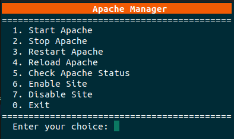

# Apache Control Script

This is a simple bash script for controlling Apache on Ubuntu. It offers a menu for starting, stopping, restarting, reloading Apache, checking Apache's status, and enabling or disabling sites.

## Features

- Start Apache
- Stop Apache
- Restart Apache
- Reload Apache
- Check Apache's status
- Enable a site
- Disable a site
- Exit the script

## Usage

1. Download the script or clone the repository
2. Make the script executable with the command `chmod +x apache_manager.sh` 
3. Run the script with root permissions, as the Apache control commands generally require root privileges. Use the command `sudo ./apache_manager.sh`
4. Follow the prompts in the script to control Apache

## License

This project is licensed under the terms of the MIT license.
